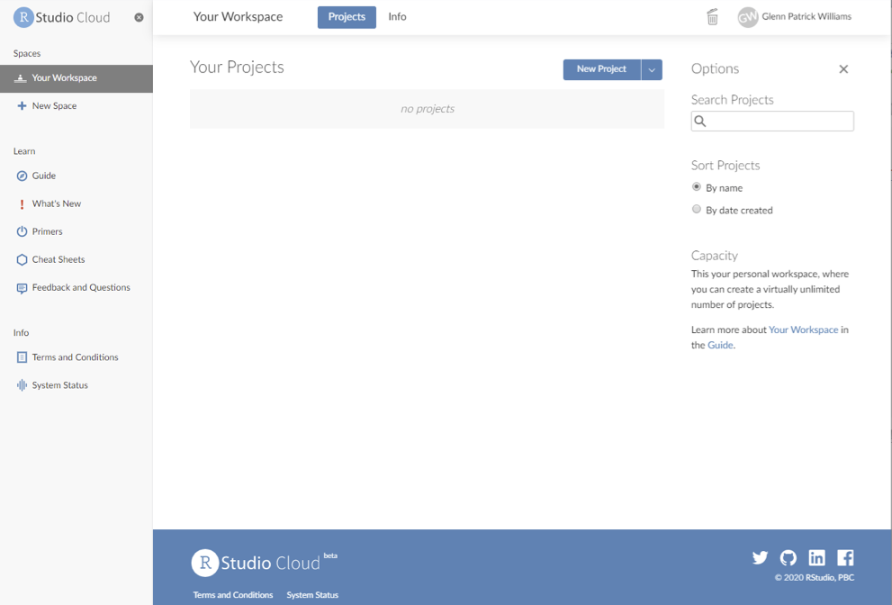
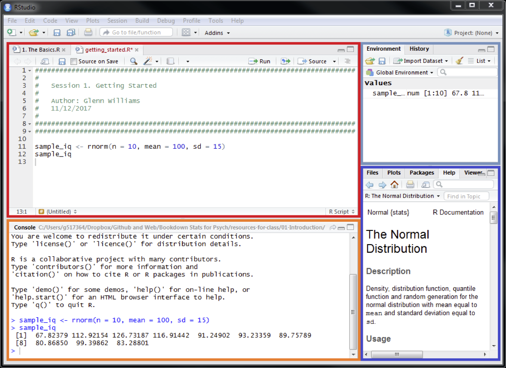
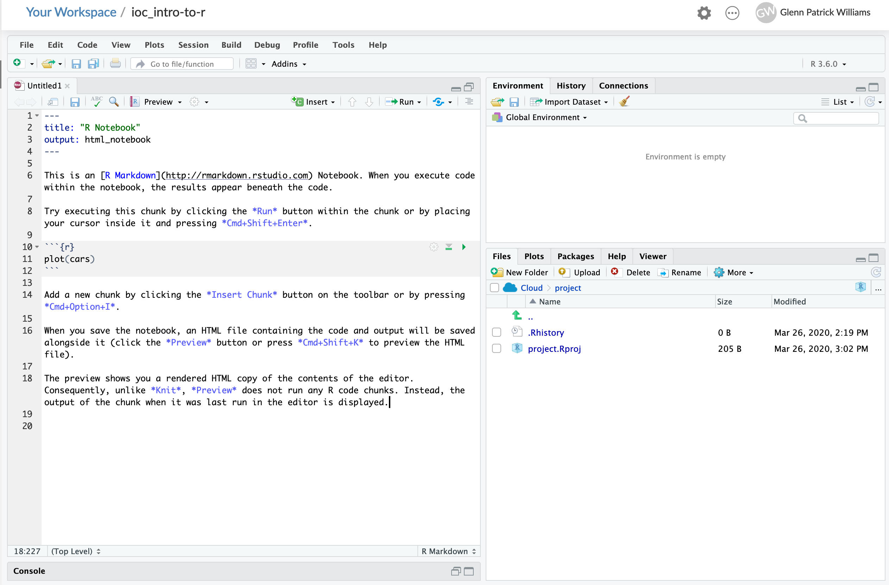
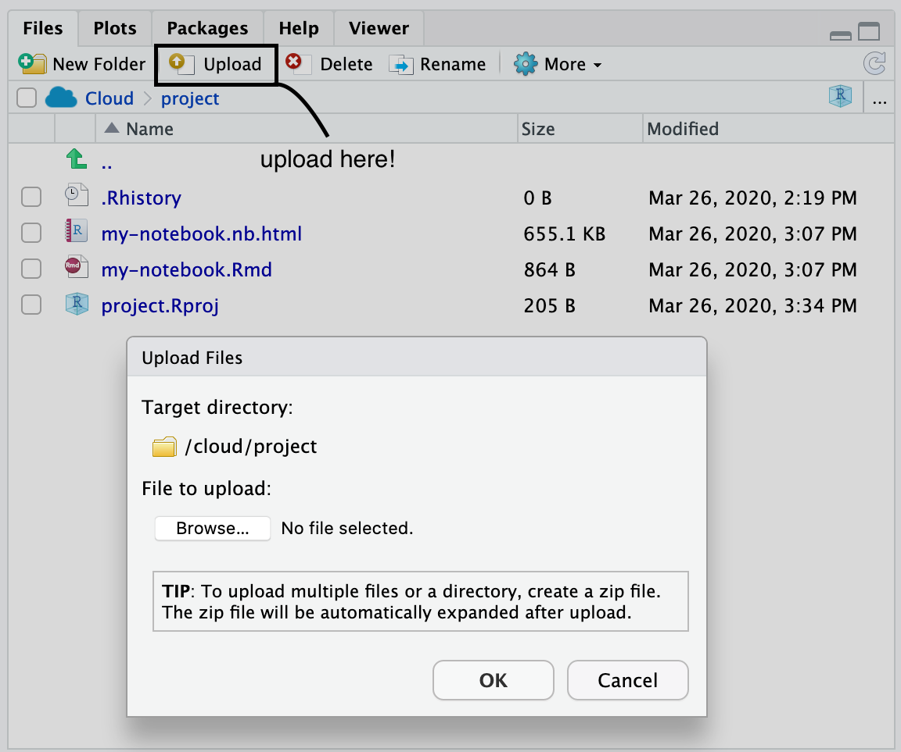
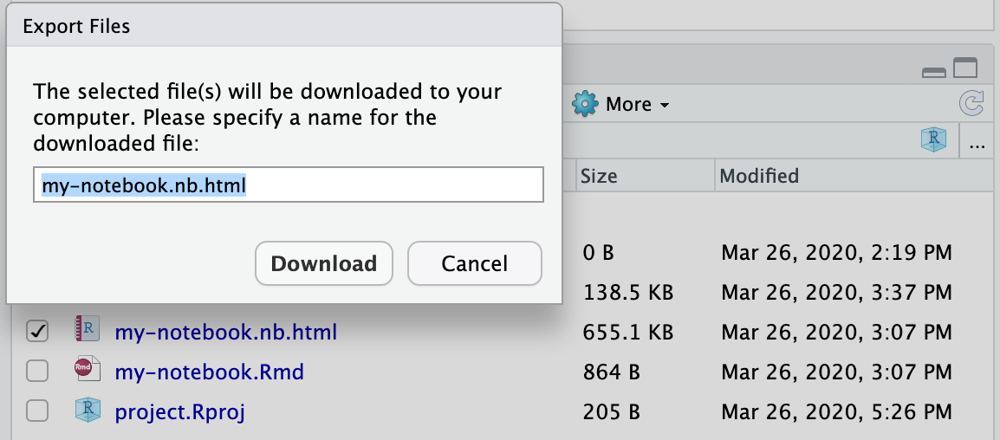

```{r setup, include=FALSE}
options(htmltools.dir.version = FALSE)
set.seed(100)
```

```{r functions, echo = FALSE}
colorise <- function(x, color) {
  if (knitr::is_latex_output()) {
    sprintf("\\textcolor{%s}{%s}", color, x)
  } else if (knitr::is_html_output()) {
    sprintf("<span style='color: %s;'>%s</span>", color, 
      x)
  } else x
}
```

# What is R?

.pull-left[

- **Statistical programming language** used for wrangling, summarising, analysing, and graphing data.

- **Free and open source**, so anyone can see how it works and add to the development of the program.

- Packages and changes are vetted by reviewers, so we can be sure most things we do in R are appropriate.

- Often used with **RStudio** which has some quality of life improvements.

]

.pull-right[

```{r r-logos, echo = FALSE, out.width = 300, fig.align = "center"}
knitr::include_graphics(c(
   "img/R-logo.png",
    "img/rstudio-logo.png"
))
```

]

---
# Why Should I Care?

- Veldkamp et al. (2014): 63% of articles contained at least one *p*-value that was incorrect given the reported test statistic and degrees of freedom.

    - In 20.5% of cases, such errors lead to **erroneous decisions** about the statistical significance of the effect.

- Given that scientific claims often rely upon formal analyses, **transparency is crucial** for assessing the credibility of such claims (Klein et al., 2018).

- R is rapidly developing, allowing a number of new analyses to be adopted easily.

---
# How Do I Install R?
## Local Installation

## Installation and Setup

- To get started, at the very least you'll have to [download R from CRAN](https://www.r-project.org/).

- Choose a mirror from which to download R. Any will do.

- Select the correct distribution for your operating system and then click through to **install R for the first time** for Windows, or just the most recent install version for Mac/Linux.

- You'll see a new page; For Windows users, click on "Download R [version number] for Windows.".

---
# What is RStudio? How Do I Install It?
## Local Installation

**IDE for R**: RStudio, makes working with R and extensions to it easier. Has Git integrated for version control, and allows for easily creating and updating codebooks.

- Download from the [RStudio website](https://rstudio.com/).

- In the navigation panel on the website:

    - Select products and choose **RStudio**.

    - Scroll down until you see **Download RStudio Desktop**.

    - Click the **Download** button in the free tier and select the correct installer for your operating system.

---
# Getting Started in the Cloud

Alternatively, we can use [RStudio Cloud](https://rstudio.cloud) to do everything online. 

- Sign up for an account by clicking sign up on the [homepage](https://rstudio.cloud/). You can register easily with your Google or GitHub accounts.

- This may be the easiest route, especially if your system is locked down (e.g. on University controlled computers).

- This may be a little more limited than using R on your machine, but most things you need will be available.

- Many guides for getting started in RStudio Cloud are available on their website.

---
# RStudio Cloud

This is the **workspace**, where you store your projects and access things like cheat sheets and guides on how to use R.


.pull-left[

- We can start a new project by clicking the **New Project** button.

- This will take a little while, but it will open up the **RStudio interface**, allowing you to perform your data tasks and analyses online.

- You can rename your project once started.

- We'll use this to create codebook to explain everything you need to do for this session.

]

.pull-right[

```{r rstudio-workspace, echo = FALSE, out.width = 400, fig.align = "center"}

```

]

---
# Lesson Plan

- Code along with me while I explain some basic concepts in R.

- We will cover:

    - **Importing data**.
    
    - **Cleaning data** and performing basic data operations.
    
    - **Summarising data** with descriptive statistics and graphs.
    
    - Performing **simple linear regression** analyses.
    
*Further explanations are available via my [R4Psych Web Book](http://glennwilliams.me/r4psych), an R course for Psychologists assuming a basic background in statistics*

---
# Making a Codebook

You can write scripts in R that only allow your R code and comments. However, it's often useful to have a **codebook**, which allows you to document and explain what it is you're doing.

- In R, these take the form of Rmarkdown documents.

- Markdown is a simple markup language that allows you to create your content and control how its displayed separately. Here's a [cheatsheet on writing in Rmarkdown](https://rstudio.com/wp-content/uploads/2015/02/rmarkdown-cheatsheet.pdf).

- With codebooks you can type in plain English to record your thoughts/comments, and include code chunks which, when executed, will run your R code.

- It's often useful to use this notebook to explain **why you've done something** (your code should explain the how).

Make your codebook by clicking **File --> New File --> R notebook**. (This will create a notebook that updates every time you save. Alternatively, html or pdf output notebooks will only update when you recompile it.)

---
# Understanding the RStudio Interface

```{r rstudio-interface, echo = FALSE, out.width = 400, fig.align = "center"}

```

.pull-left[

`r colorise("Editor", "red")`: Type and edit code here. This is usually where your notebook will go. 

`r colorise("Console", "orange")`: Code is executed here. You can cycle through commands by using the up and down keys.

]

.pull-right[

`r colorise("Environment", "LightSkyBlue")`: What variables are in your session? What are they made up of?

`r colorise("Viewer", "blue")`: What files are in your dirctory? View any plots/help here too. (Get help by typing `?command_name` in the console)

]
---
# Making a Codebook

.pull-left[

- On the first creation in a project, RStudio will ask if you want to update packages, do this and you'll see a new untitled project in your **Editor window**.

- Check your Files pane in the bottom right. This hasn't been saved yet. So, give the notebook a sensible title by replacing the text in `title: "R Notebook"` double quotes.

- Save this with File --> Save As or Ctrl/Cmd + S. Give the file a name and save it in the base directory.

]

.pull-right[

```{r rnotebook-screen, echo = FALSE, out.width = 400, fig.align = "center"}

```

- RStudio automatically creates an RStudio Project with your files. By default, your **working directory** is wherever your Project file is. This allows easy reading and writing of files using **relative file paths**.

]

*By default, R notebooks show you how to use R code chunks and simple markdown commands.*

---
# Installing and Loading Packages

Many packages are available via CRAN. These make performing particular functions easier without having to write everything from scratch.

```{r data-and-libraries, echo = FALSE, message = FALSE}
library(tidyverse)
library(here)
library(broom)
```

Only once per project, or per machine, do you have to install a package. After this (and with every session) you need to load the packages for use.

Install the packages with:

```{r install-packages-class, eval = FALSE}
install.packages("tidyverse")
install.packages("here")
```

Then load it with:

```{r load-packages-class, eval = FALSE}
library("tidyverse")
```

It's usually a good idea to include the libraries in a code chunk at the start of your document. Do this now by making a code chunk using **Insert --> R** and typing your library functions here. If not already installed, RStudio will ask you if you want to install them.

---
# Reading Data into R

The `tidyverse` package makes working with your data (including reading, writing, cleaning, merging, and plotting) easier in R. `here` also makes using relative file paths easy across different operating systems.

1. First, you need to download some data. Get this from [the link for this course content on GitHub](https://github.com/gpwilliams/ioc_intro-to-r-stats).

2. Click clone or download, and download Zip. Then unzip the files and access the data via the subfolder intro-to-r/data.

3. There's one data file in here: **lexdec_raw.csv**. This looks at a lexical decision task (is the word on your screen a real word). We have some **variables** recorded such as the native language of the speaker, what the word was, and how **frequent** this word is.

---
# Reading Data into R

.pull-left[

- Now you have the data downloaded, you need to **upload it to RStudio**. Do so by going to Files, Upload, and then select the data file from wherever it is on your computer. Click OK.

]

.pull-right[

```{r upload-screen, echo = FALSE, out.width = 200, fig.align = "center"}

```

]

- Once in your file pool, you can work with the data. But first, we must assign this to a variable. Do so by setting up another code chunk where you assign your data to a varaible by reading in the .csv file:

```{r read-data, echo = FALSE, message = FALSE}
lexdec_data <- read_csv(here("intro-to-r/data/lexdec_raw.csv"))
```

```{r read-data-class, eval = FALSE}
lexdec_data <- read_csv("lexdec_raw.csv")
```

- This code uses `read_csv()` to read the data. 

- We set the file path to grab the data by using the `here` function from the `here` package and setting the **full file name including the subfolder** in which it is located. 

- Finally, we assign this to a variable using the assignment operator `<-`.

---
# Basic Functions in R

- We've already seen how to **assign** things to variables. Once assigned to a variable, we can perform operations on our data.

- **Variables** can be anything: numbers, strings (text), lists, matrices, or even data frames.

- **Data frames** are very useful in R: These are **tables that can contain vectors**. The data frame can be made up of separate data types (e.g. strings or numbers), but you can't mix data types within columns without **type coercion**.

- We can perform logical operations on our data as in most languages: e.g. `x < y`, `x == y`, `x != y`.

- We can perform basic mathematical operations: e.g. `x + y`, `x/y`, `x*y`.

- Nicely, R has some default packages for more advanced operations: e.g. `mean(x)`, `sd(x)`, `length(x)`.

*More details are available at the [R4Psych page](https://glennwilliams.me/r4psych/introduction.html).*

---
# Data Frames and Tibbles

By default, the tidyverse functions (e.g. `read_csv`) assign your data to a variable as a tibble if read in as a table of data. 

- This package makes best guesses as to the data types in your .csv.

- Take a look at what the data looks like in R. Add a chunk with the variable name:

```{r head-data, message = FALSE}
glimpse(lexdec_data)
```

---
# Data Frames and Tibbles

- We've now that we have 9 variables, with 1952 observations. We can also see the data types for these variables here.

- How can we work with our data? We can extract individual columns using dollar notation. Let's see what the mean score is for RT (reaction time):

```{r dollar-notation}
mean(lexdec_data$RT, na.rm = TRUE)
```

*note, we added the additional argument na.rm = TRUE to remove NAs prior to calculating the mean, otherwise this would return NA.*

This is actually quite a messy data set, allowing us to see how certain functions help with real-life data in R.

---
# Making Graphs in R

.pull-left[

- The tidyverse has a package called ggplot2 within it used for making plots.

- We build them up by **layers**. What’s the data, and how should we present it?

- We always need to tell ggplot the **data source** and where to **map the variables** (e.g. on x/y axis).

- We use **geometric objects (geoms)** for making them.

- Let's make a box plot to explore our data. Add another code chunk:

]

.pull-right[

```{r simple-boxplot, out.width = "60%", fig.align = "center"}
ggplot(
  data = lexdec_data, 
  mapping = aes(
    x = native_language, 
    y = RT
    )
  ) +
  geom_boxplot()
```

]

---
# Cleaning Data

Oh no, **we got a warning from the output**! Also, those categories have been **coded terribly**. Let's make the names more consistent. To do this, we'll use the `dplyr` package from the `tidyverse` family of functions.

```{r clean-names}
lexdec_data <- lexdec_data %>% 
  mutate(native_language = tolower(native_language))
```

- There's a lot to unpack here. First, we take our data and **pipe** it into another function, `mutate()`. This allows us to change a data frame. To change our names, we set it to itself, just with all names in lower case by using the `tolower()` function. 

- We then assign our data back to itself.

Let's check out how many names we have now:

```{r check-cleaned-names}
unique(lexdec_data$native_language)
```

---
# Making Plots in R

.pull-left[

Maybe remove all reaction times with NAs, and maybe just keep the two languages we care about:

```{r exclude-na}
lexdec_data <- lexdec_data %>% 
  filter(
    !is.na(RT),
    native_language %in% 
      c("english", "other")
  )
```

Let's check our data again. Add a new code chunk:

```{r updated-boxplot-code, eval = FALSE, out.width = "50%"}
ggplot(
  data = lexdec_data, 
  mapping = aes(
    x = native_language, 
    y = RT)) +
  geom_boxplot()
```

]

.pull-right[

```{r updated-boxplot-plot, echo = FALSE, warning = FALSE, out.width = "100%"}
ggplot(
  data = lexdec_data, 
  mapping = aes(x = native_language, y = RT)
  ) +
  geom_boxplot()
```

Better! But, the boxplot shows **many RTs are outliers**. Why? This is because we're **plotting all of the raw data**, and trials can vary a lot by subject.

]

---
# Making Averages by Subject

We'd like to fit a linear model to our data, but one of the assumptions is that **observations are independent of one-another**. This is not the case here, where we have several observations per participant. What do we do?

We can make by-participant averages by **grouping our data** by subject and native language, and making a **summary by each group** for the mean, *SD*, and number of observations:

.pull-left[

```{r lexdec-subj}
lexdec_subj <- lexdec_data %>% 
  group_by(
    subject, 
    native_language
  ) %>% 
  summarise(
    RT = mean(RT)
  )
```

Let's inspect this now (gettng the first 4 rows, and all columns with square brackets):

]

.pull-right[

```{r}
lexdec_subj[1:4, ]
```

]

---
# Creating Variables

.pull-left[

Let's inspect our reaction times. Are they normally distributed?

```{r check-dist, warning = FALSE, out.width = "75%"}
ggplot(
  data = lexdec_subj, 
  mapping = aes(x = RT)
  ) +
  geom_density()
```

*Oh no, that' really skewed (like most reaction times...)*

]

.pull-right[

`mutate()` doesn't just change things; it can create new variables too. Let's log transform the reaction times:

```{r make-log-rt}
lexdec_subj <- lexdec_data %>% 
  group_by(subject, native_language) %>% 
  summarise(
    RT = mean(RT),
    log_RT = log(RT)
  )
```

Check our our data now:

```{r inspect-log-rt}
lexdec_subj[1:2, 2:4]
```

]

---
# Our Final Plot

.pull-left[

```{r final-plot}
logRT_boxplot <- ggplot(
  data = lexdec_subj, 
  mapping = aes(
    x = native_language, 
    y = log_RT)) +
  geom_boxplot()
```

What's it look like? Much better! But the proof will be what the residuals look like...

We can then save this plot using the `ggsave` function:

```{r ggsave, eval = FALSE}
ggsave(
  "logRT_boxplot.png", 
  logRT_boxplot
)
```

]

.pull-right[

```{r final-plot-inspect}
logRT_boxplot
```

]

---
# Summarising Data in Tables

Here, as before, we'll **group our data** by native language, then we make a **summary by each group** for the mean, *SD*, and number of observations:

```{r data-summary}
lexdec_summary <- lexdec_subj %>% 
  group_by(native_language) %>% 
  summarise(
    mean_logRT = mean(log_RT),
    sd_logRT = sd(log_RT),
    n = length(unique(subject))
  )
```

Inspect the data:

```{r data-summary-inspect}
lexdec_summary
```

---
# Fit a Model

Now we have our descriptive statistics and our plot of the data, let's fit a **linear regression to our log reaction times, split by native language**.

First, we need to set native language to a **factor**. This allows us to use R's contrast coding. Let's do this then inspect the contrasts:

```{r check-contrasts}
lexdec_subj$native_language <- as.factor(
  lexdec_subj$native_language
)

contrasts(lexdec_subj$native_language)
```

Remember, if we want to fit a linear regression with `native_language` as our variable, the **intercept** will be native_language where the value (contrast) is 0. The **slope** then represents a 1 unit change in this.

*Right now, our intercept will be the mean log RT for English, and the slope will be the difference between English and Other*.

---
# Fit a Model

Let's use **deviation coding** to make the **intercept the grand mean** and the **slope the difference between conditions**. This is useful to know and necessary when adding multiple factors to our model.

```{r set-contrasts}
contrasts(lexdec_subj$native_language) <- c(-.5, .5)
```

```{r see-contrasts}
contrasts(lexdec_subj$native_language)
```

Nice!

---
# Fit a Model

R uses a formula interface for defining linear models. The below formula:

`log_RT ~ 1 + native_language`

Says log reaction time is a product of an interept (1) and a slope for native language (i.e. the grand mean and your native language determines your reaction time score).

```{r fit-model}
lexdec_mod <- lm(log_RT ~ 1 + native_language, data = lexdec_subj)
```

What are the coefficients of the model?

```{r model-coefficients}
lexdec_mod
```

---
# Inspect the Model

To see the model output, including parameter estimates and test statistics, we use the `summary()` function:

```{r summary-model}
summary(lexdec_mod)
```

---
# Interpret the Model

- The model output states that the grand mean is around 6.41 on the log scale, and the difference between conditions is around 0.122 on the log scale.

- Only the intercept is **significantly different from zero**.

- This means that we we **cannot reject the null hypothesis** that speakers don't differ in terms of their lexical decision times by native language.

- Thus, although there is a numerical difference in scores, this is **not sufficiently suprising compared to zero** for us to say this difference will be present in the population.

- Can we confirm where these values come from?

---
# Interpreting Model Estimates

```{r see-summary-stats-again}
lexdec_summary
```

What's the difference in scores? Does it match our model output of around 0.122?

```{r calculate-difference}
lexdec_summary[2, 2] - lexdec_summary[1, 2]
```

---
# Saving our Output

We already saved our final plot. But how do we save our model output and descriptive statistics?

For the descriptive statistics, we just use `write_csv()`. 

```{r save-descriptives, eval = FALSE}
write_csv(lexdec_summary, "lexdec_summary.csv")
```

However, for the model output, we need to get this in a tabular format first. One useful package for converting statistical output to a table is the `broom` package; install and load it (probably best at the start of your notebook).

```{r eval = FALSE}
install.packages("broom")
library(broom)
```

---
# Saving Model Output

Let's see how `broom` works, using the `tidy` function (I'll round these values, too):

```{r}
lexdec_mod %>% 
  tidy() %>% 
  mutate_if(is.numeric, round, 3)
```

*p-values are often reported as 0 when rounded from very small numbers, but can never be exactly 1 or 0 as they represent probabilities from which we can't ever be certain about their true value; thus report p = 0 as p < .001.*

Save our tidied output with:

```{r save-model-output}
write_csv(tidy(lexdec_mod), "lexdec_mod.csv")
```

---
# Accessing our Research Products

- You should now have a list of files in your **file pool**, including your raw (input) data, your descriptive statistics, plot, and model.

- You can export these by going to your **File pane**, clicking on a file, clicking **More** --> **Export...** and then choosing a name for your file. You can then download this to your computer.

```{r export-screen, echo = FALSE, out.width = 300, fig.align = "center"}

```

You may want to download all these separate files (e.g. for use in another document), or to download your HTML/PDF output for your codebook for sharing with others.

---
# Final Remarks

- This was a really **quick crash course in R**, so not all concepts could be explored fully. However, I hope this was a nice introduction to just how much you can do, and quickly, with R.

- Using **R notebooks** like this allows you to document everything you've done, so you (and others) can confirm the accuracy of your work.

- We've seen how to filter and clean our data, how to make summaries of our data, and how to plot and model our data.

- The R syntax can be difficult to learn, but with the `tidyverse`, we can make use of a number of plain English verbs for working with data.

- To learn more, I suggest you check out a number of useful, free resources such as [r for data science](https://r4ds.had.co.nz/) and [r4psych](https://glennwilliams.me/r4psych/) (which adapts r4ds from a psychologist's perspective).

---
# Bonus Slide: Checking Model Fit

Were we right to fit a model on log transformed reaction times? What do our residuals look like?

.pull-left[

- These seem fine, but there may be an outlier in our data (at the top right) indicating our 19th participant is quite different from the rest. 

- Here, we might be justified in checking individual responses from this participant. If we're really concerned and don't want to filter people out, we may alternatively use a **non-parametric test** (e.g. on ranked observations).

]

.pull-right[

```{r check-resid, out.width = "75%", fig.align = "center"}
plot(lexdec_mod, which = 2)
```

]