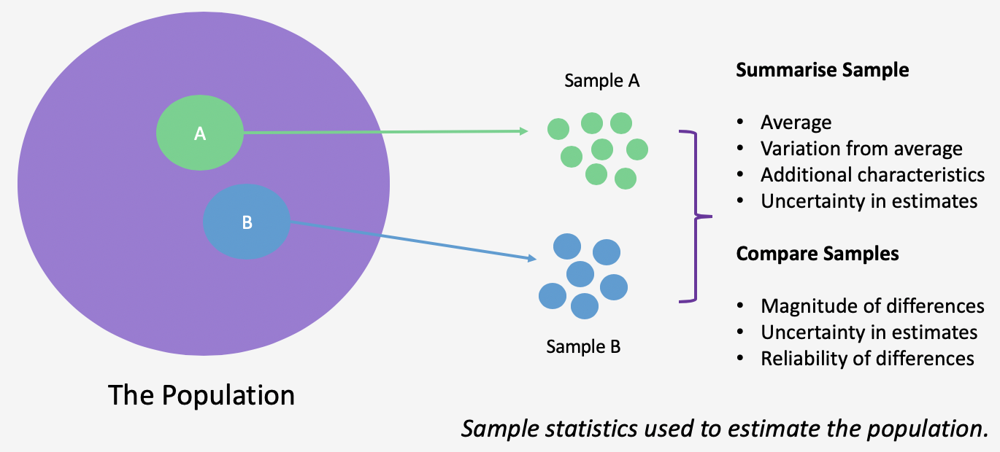
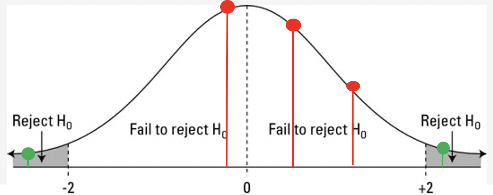
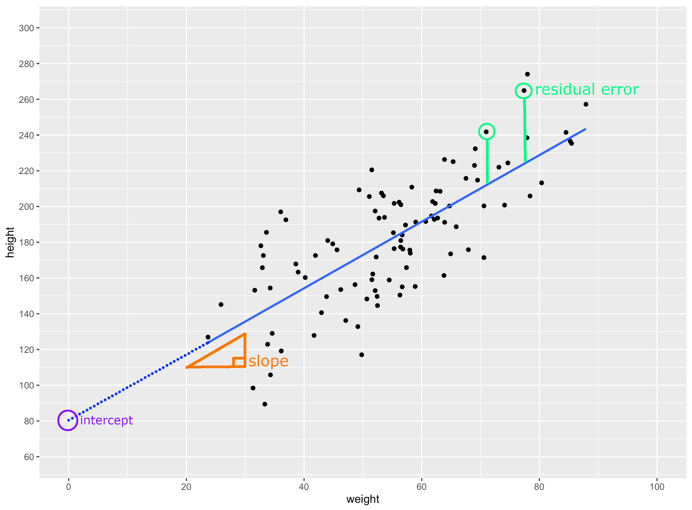

```{r setup, include=FALSE}
options(htmltools.dir.version = FALSE)
set.seed(100)
```

```{r data-and-libraries, include=FALSE}
library(tidyverse)
library(here)

lexdec_dat <- read_csv(here("intro-to-stats", "data", "lexdec_ind.csv"))
lexdec_raw_dat <- read_csv(here("intro-to-stats", "data", "lexdec_raw.csv"))
smoking_dat <- read_csv(here("intro-to-stats", "data", "smoking.csv"))

population_img <- here("intro-to-stats", "img", "population-and-samples.png")
```

# Learning Outcomes

Understand...

- How we **quantify differences and associations** between groups of data.

- How samples of data are drawn from **distributions**.

- The logic behind **hypothesis testing** and *p*-values.

- The basics of **linear regression**.

- **Confidence intervals** and their use.

- How to check the robustness of your **linear models**.

---
# The Aim of Statistics

We sample data from a wider population and crunch numbers on the sample to draw inferences about the wider population.


---
# What's the Aim of Statistics?

Statistics allow us to summarise, interpret, and predict complex relationships based on observations of a sample.

These can be **descriptive**:

- Measures of **central tendency**/the average: e.g. mean, median, mode.

- Measures of **dispersion**: spread in scores, e.g. range, variance, standard deviation.

Or **inferential**: Would this observation from my sample scale up to the population?

Statistical tests can also be **parametric**, describing estimating parameters (i.e. something measurable) for a population from an assumed distribution, or **non-parametric**, describing summarising data with no assumed distribution.

---
# How Does it Work?

If we have the whole population, we don't need inferential statistics. 

.pull-left[

- These are used only when we want to see if an effect in our sample is likely to be observed **in the entire population**.

- e.g. if we **measure all astronauts, we just describe differences**. If we measure some psychologists and want to make a best guess at the average height, we **estimate the height parameter**.]

.pull-right[
```{r astro, echo = FALSE, out.width = 200, fig.align = "center"}

```

]

There are many methods for conducting statistics, but we'll focus on **frequentist statistics** using the **general linear model**.

???

- This leads us to the issue of parameters and statistics: a parameter describes some measurement in the population. We can estimate these using statistics. You'll often see people talking about parameter estimates, that's what these are.

- Frequentist statistics look at controlling how long we make a mistake in the long run. The GLM is extensible to many designs.

---
class: inverse, center, middle
# Summarising Data

---
# Types of Data

- **Categorical or Nominal**: numbers used to represent **belonging to a group**; 

    - e.g. 1 = female
    - 2 = male, 
    - 3 = non-binary, etc. 
    
  These assignments are arbitrary and differences between numbers aren't interpretable.

- **Ordinal**: numbers used to represent belonging to a **category along an ordered set**. Crucially, the differences between these are not known; e.g. a Likert scale for hotness of a chilli, place in a race.

- **Scale**: numbers used to represent an **interval or ratio**. The differences between numbers are informative and equivalent; e.g. measures of time, length, accuracy.

---
# Summarising Types of Data
## Descriptive Statistics

**Descriptive statistics** are the way in which we describe the **central tendency and spread of scores** in our data set. Essentially, they're a quick summary so we don't have to look at all of the raw data.

- **Counts**: how many occurrences in the data set? Useful to note how many missing data points are in your set.

- **Central tendency**: the mean (total of scores divided by total observations), median (midpoint of scores), mode (most common value) are regularly used.

- **Dispersion** (spread of scores): the interquartile range and standard deviation are often used here. The interquartile range shows where the middle 50% of scores lie. The **standard deviation** shows where different proportions of the data lie on a standard scale.

    - 68.2% of scores lie within 1 *SD* of the mean.
    - 95% of scores lie within 2 *SD* of the mean.
    - 99.7% of scores lie within 3 *SD* of the mean.

---
# Summarising Types of Data
## Categorical/Nominal Data

.pull-left[

- For categorical or nominal data, we often want to **summarise counts of these data**. Simply state totals or display a frequency graph.

- Making e.g. means or medians of these counts is uninformative; e.g. if you have groups designated by 1, 2, and 3, what would a score of 2.5 even represent?

]

.pull-right[

```{r categorial-data, echo = FALSE}
computer_counts <- tibble(
  group = c("linux", "mac", "windows"),
  count = c(10, 20, 50)
)

ggplot(computer_counts, aes(x = group, y = count)) +
  geom_bar(stat = "identity")
```

]

---
# Summarising Types of Data
## Ordinal Data

Distributions are often skewed so the mean/SD does a bad job at describing the data. Instead, we rely on:

.pull-left[

- Box plots display the **median** (black line), along with the **interquartile range**/middle 50% of scores (white box); central tendency and dispersion.

- The lines represent the smallest and largest observations equal to ± 1.5 times the interquartile range (effectively, most of the other scores).

]

.pull-right[

```{r ordinal-data, echo = FALSE, out.width = 300}
likert_data <- tibble(
  group = c(rep("R", 100), rep("SPSS", 100)),
  satisfaction = c(rbeta(100,5,2) * 7, rbeta(100,2,2) * 7)
)

ggplot(likert_data, aes(x = group, y = satisfaction)) +
  geom_boxplot()
```

]

- Dots represent **outliers** (i.e. ± 3 times the interquartile range).

---
# Summarising Types of Data
## Scale Data

- Scale data are easily summarised using the **mean**. With normally distributed data, the mean, median, and mode are interchangable.

.pull-left[

- Dispersion is represented by the **standard deviation**: Capturing **where most of the scores lie**. e.g. 68.2% scores lie within 1 *SD* of the mean, 95% scores lie within 1.96 *SD* of the mean, 99.7% of scores lie within 3 *SD* of the mean. 

  Small standard deviations indicate most values lie close to the mean, large values mean fewer values are close to the mean.
]
.pull-right[

```{r scale-data, echo = FALSE, out.width = 300}
height_data <- tibble(
  group = c(rep("men", 60), rep("women", 60)),
  height = c(rnorm(60, 175, 40), rnorm(60, 161, 30))
)

ggplot(height_data, aes(x = group, y = height)) +
  stat_summary(fun = "mean", geom = "bar") +
  stat_summary(fun.data = "mean_se", geom = "errorbar", width = 0.25)
```
]

---
# Distributions of Data
## The Normal (Gaussian) Distribution

Many of our summaries of data rely on us making assumptions about the underlying distribution of the data. For example, when calculating the standard deviation, we can interpret this accurately if our data follow a **normal distribution**.

.pull-left[

Why are most scores close to the mean? **There are many more ways to make these scores than extreme scores**. There are many ways to get 5 heads in 10 coin flips, but only one way to get 10 heads out of 10 flips.

We use the normal distribution for modelling because it is **easy to represent mathematically** and many processes in nature follow this distribution.

]

.pull-right[

```{r normal-distribution, echo = FALSE, out.width = 300}
ggplot(tibble(x = c(-3, 3)), aes(x)) +
  stat_function(fun = dnorm, n = 101, args = list(mean = 0, sd = 1)) + 
  scale_y_continuous(breaks = NULL) +
  scale_x_continuous(limits = c (-3.5, 3.5), breaks = seq(from = -3, to = 3, by = 1)) +
  labs(x = "Standard Deviation", y = "") +
  geom_vline(xintercept = c(-2, 2), linetype = "dashed") +
  annotate(geom = "text", x = 0, y = 0.15, label = "95% of scores")
```

]

---
# Distributions of data
## The Normal (Gaussian) and T Distributions

- When we know the mean and **standard deviation** for a parameter, it can be accurately modelled by the **normal distribution**.

- But, when we want to **estimate the mean of a small sample with an unknown standard deviation**, the **T distribution** often gives us more reliable estimates.

- This is like the normal distribution, only with fatter tails, which captures the propensity for small samples to produce more extreme results. 

- The shape of the T distribution depends on the sample size, but approximates the normal distribution with large samples.

---
# Why Rely on Distributions of Data?

- If we make assumptions about the distribution from which our data were sampled, we can **predict how likely our results are given that distribution**.

- Typically, we **assume there's no effect in the population** (more on this later), and see how likely our results would be if that were the case.

- From our sample, we can calculate a *z*-score or *t*-statistic which is a standardised measure of the presence of an effect, taking into account the mean and standard deviation of scores from a given sample.

- We know how likely these scores are for a **normal** or **T distribution** respectively. Rare findings are thus seen as evidence of the presence of an effect in the populaton.

---
# Interim Summary

- Data can be summarised in different ways. With **scale data** we often summarise this with the **mean and standard deviation**.

- Many statistical tests rely on us making assumptions about the **underlying distribution of data** from which our samples were drawn.

- If we assume our data are drawn from a certain distribution, we can calculate **how likely we are to observe the findings we got**. We can also then accurately model the parameters we are trying to estimate.

- We often rely on the **T distribution** because it allows for accurate inferences from small samples drawn from a population with unknown standard deviation.

---
class: inverse, center, middle

# Inferential Statistics

---
# Frequentist Statistics

Largely informed by 3 influential statisticians: Sir Ronald Fisher, Jerzy Neyman, and Egon Pearson.

```{r stats-guys, echo = FALSE, out.width = 300, fig.align="center"}

```

- Approaches probability from an **objective** standpoint: probability refers to events in the world, not our beliefs. Thus, it should refer to frequencies of events vs. some collection of other possible events.

- e.g. if a coin comes up heads in 7 of 10 coin flips, is it fair? I need to estimate the likelihood of observing this outcome given **infinite coin flips** and assuming a fair coin.

- A hypothesis is either true or false. It does not have a probability of being true (c.f. Baysian statisics)

---
# The Frequentist Approach to Probability

- We might generate the probability of observing our data given a hypothesis: *P(D | H)*
  
  e.g. *P(getting 7 heads from 10 flips | my coin is fair)*
  
- This is one event. With infinite events, we can see how many sets of coin flips would produce this result. This is a meaningful measure of probability.

- We **CANNOT** invert this probability, i.e. *P(H | D)* as we have no collective set of hypotheses.

  e.g. *P(dying | head bitten off by a shark)* = 1 (everyone dies if this happens)
  this is not the same as *P(head bitten off by a shark | dead)* (which is 0, practically nobody who is dead died to a shark bite).
  
- Thus, our findings are interpreted as **how likely our data are given a hypothesis**. They are not how likely our hypothesis is given our data.

---
# Neyman, Pearson, and the Objective Probabilists

- Neyman-Pearson frequentist statistics doesn't tell us how much we should believe in a hypothesis. Instead, it gives us decision rules which -- if followed -- **control the rate at which we make incorrect decisions over time**.

- Often, we compare our data against a **null hypothesis** of no effect: e.g. drug effect = placebo effect (H_0_) against drug effect > placebo effect (H_1_)

- Why? The null hypothesis is often the one which is **most costly to reject**. Imagine incorrectly saying your drug has an effect when it doesn't. You'll cost lives and money.

---
# Hypothesis Testing
## Generating a *p*-value

Frequentist statistics is largely concerned with **hypothesis testing**, i.e. stating a prediction for the data given some theoretical perspective, and seeing whether this holds up.

- For normally distributed data, we can assume that the data have a mean of 0 and some unknown variance (related to *SD*); i.e. that there's no effect in the population.

- We can then determine how often we will observe an effect **as big or bigger than the one we've observed if we were to repeat sampling** from this distribution idefinitely.

- We can then generate the probability of observing such an effect given the null hypothesis is true: the *p*-value.

---
# Hypothesis Testing
## Working Out *p*-values from Samples

- We can work out the *p*-value for a test by taking into account **parameter estimates** from our sample, e.g. mean, *SD*, number of observations.

- The best way to get estimates for dispersion for hypothesis tests (at least for normally distributed data) is to generate a **standard error**: a measure of variation in the sample dependent on the sample size.

- We can then use the **mean, standard error, and sample size** to determine a *t*-statistic: this is the standardised size of an effect relative to variation in the sample.

- We know the shape of a *t* distribution, so we can then work out how surprising your *t*-value is **assuming no effect in the population**; finally, we have the *p*-value.

---
# Hypothesis Testing
## A Visual Depiction of the Distribution of *t*-values under the Null Hypothesis

Large *t*-values, indicative of large differences between groups of data, (in both positive and negative directions) are less likely than small *t*-values. The probabilities of *t*-values can be worked out...

```{r p-val-given-null-plot, echo = FALSE, out.width = 500, fig.align = "center"}

```

---
# Hypothesis Testing
## Interpreting *p*-values

- Using a pre-defined cut-off, $\alpha$, *p*-values below a given threshold can be **interpreted as evidence in support of a true effect in the population**. With this strategy, we'll only make a wrong conclusion about the presence of an effect at the rate given by our *p*-value threshold.

- In Psychology, this is typically set to $\alpha$ = .05, or a 5% false-positive rate. (Set by Fisher, who since argued against mindless thresholds.) Any values below this are deemed **"statistically significant"** evidence for an effect.

- In stricter cases, we may set the $\alpha$ level to something even smaller, e.g. .01. This means we only have a **1% chance of getting a false-positive**. However, it also means we need more convincing evidence to support our conclusion. (e.g. bigger effects, or more data.)

---
# Interim Summary

- Frequentist **inferential statistics** is concerned with controlling error rates in the long run.

- This type of statistics argues that we should **assume the null hypothesis is true**, and see how likely our data is given that assumption. Unlikely data are thus provide evidence against the null hypothesis.

- Given an **alpha level**, we can work out how likely are data are under the null hypothesis, the *p*-value. If our data are less likely than our **alpha level**, we reject the null hypothesis.

- *p*-values can be worked out by combining parameters from our sample to make a test statistic, and seeing how likely this is under the null hypothesis.

- Following this philosophy, we know that we will only accept a false-positive at a rate determined by our **alpha level**. This control the strength of evidence needed to infer a true effect.

---
class: inverse, center, middle

# Linear Regression

---
# Linear Regression

Learn the mean and *variance* of some measurement by using an additive combination of other measurements.

- The **geocentric model of applied statistics**: used wisely, can be useful. But we shouldn't read too much into the numbers produced. They're almost certainly wrong because we can't (and shouldn't) model all sources of variance.

- Predict a **linear relationship** between one or more variable(s) and a continuous (e.g. scale) dependent variable.

- Predictor variables can be continuous or categorical.

- Many statistical tests/models, e.g. *t*-tests, ANOVAs, mixed effects models, are just extensions of the **general linear model**, so this is the most important test for you to know.

---
# Linear Regression

Takes the general form:

$$Y = \alpha + \beta X + e$$

- **Outcome** $Y$ = intercept + (slope $\times$ X) + residual error

- **Residuals** $e$ = distance of observed values from predicted values

- *Note*: We do not fit a perfect model, hence the error term. This is a good thing, otherwise we are probably **overfitting** to our data; relying too much on our observed sample to draw infferences.

---
# Linear Regression

Takes the general form: 

$$Y = \alpha + \beta X + e$$

- The **intercept**, $\alpha$, is usually the point on the y-axis at the lowest value of X (usually 0).

- The **slope**, $\beta$, corresponds to how much Y increases by for every increment in X.

- The **error**, $e$, corresponds to a constant by which to add to our estimates accounting for additional variation from other sources that we do not model.

---
# Linear Regression: An Example

Let's say we wan't to figure our the most likely **heights in a population based on weight**.

.pull-left[ 

- We can do this by relying on the heights and weights from our sample, and finding the line of best fit using **maximum likelihood estimation**; i.e. find the line that has the smallest overall error term between observed and expected values.

- How can we interpret this plot?

]

.pull-right[

```{r linear-regression-height-weight, echo = FALSE, out.width = 400}
set.seed(1)

hw_data <- tibble(
  height = rnorm(100, 178, 40),
  weight = height * 0.3 - rnorm(100, 0, 10)
)

ggplot(hw_data, aes(x = weight, y = height)) +
  geom_point() +
  geom_smooth(method = "lm", formula = "y ~ x", se = FALSE) +
  scale_x_continuous(limits = c(0, 100), breaks = seq(from = 0, to = 100, by = 20)) +
  scale_y_continuous(limits = c (60, 300), breaks = seq(from = 60, to = 300, by = 20))
```

]

---
# Linear Regression: An Example

Let's predict height from weight:

$$height = intercept + slope \times weight + error$$

Using the linear regression formula, we can figure our the **intercept** and **slope** of the line of best fit.

.pull-left[

- The **intercept is approximately 80** and the **slope is approximately 1.85**. We can also work out the residual error (i.e. unexplained deviations from our predictions in the observed data).

- The intercept is where the line begins (x = 0), the slope is how much to multiply the y-axis value by for each unit increase on the x-axis.

]

.pull-right[

```{r interpreting-regression, echo = FALSE, out.width = 400}

```

*What's the height at a weight of 40, 50, or 20kg? What about 0kg? There are limits to the model...*
]

---
# Linear Regression

- When we fit a model using linear regression in any statistics package, the line of best fit and your **parameter estimates** are estimated using maximum likelihood estimation. 

- From this, you get some parameters of interest as output, along with some statistics that we'll explain later.

The linear model **estimates parameters** associated with the intercept and slope:

```{r linear-model-height-weight, echo = FALSE}
broom::tidy(lm(height ~ weight, data = hw_data)) %>% 
  mutate_if(is.numeric, round, 3) %>% 
  mutate(
    term = case_when(
      term == "(Intercept)" ~ "Intercept",
      term == "weight" ~ "Slope"
    ),
    p.value = case_when(
      round(p.value) == 0 ~ "<.001"
    )
  ) %>% 
  rename(t.value = statistic) %>% 
  kableExtra::kable()
```

It then estimates a *t*-value based on the mean, variance, and sample size for these parameter estimates, and calculates a *p*-value testing whether these estimates are **significantly different** from 0 (i.e. tests the null hypothesis!).

---
# Interim Summary

- Linear regression is at the heart of pretty much all statistical tests. This allows you to **estimate parameters** and **test whether these parameters are surprisingly different from zero**.

- Linear regression works by trying to **predict an outcome** based on a linear combination of predictors. 

- We don't want a perfect fit to our data, or the results will not generalise well to new samples.

- All models require an **intercept, slope, and error term**. When modelling, we have to be able to code our data appropriately to understand what these terms represent.

---
class: inverse, center, middle

# Differences Between Groups of Data

---
# Differences Between Groups of Data
# Mean Differences Between Groups

The linear model is so flexible that we can specify any design, or test, we care about given our data. 

- How can we expand the model to account for differences between groups of data? We can tell the model to estimate different outcomes for two groups by using **contrast coding**.

- Remember our formula? With contrast coding, X is set to a **numeric categorical ID** for each group.

$$Y = \alpha + \beta X + e$$

---
# Contrast Coding

- Remember that the **intercept is usually the lowest value of X**. 

- If X represents group membership, how should we define our groups?

- Usually, we set one group as -.5 and another group as +.5. This means that the intercept, $\alpha$, **corresponds to the grand mean** across groups. Why? Because the intercept is set to X = 0 (the mid-point between the two groups).

- Thus, $\beta$, how much to change the outcome for a 1 unit increase in X, defines **the difference between the two groups** from this grand mean.

- This may make more sense given an example.

---
# Differences Between Groups of Data
# Mean Differences Between Groups: An Example

What if we want to check reaction times on a **lexical decision task** split by native and non-native Speakers of English? Our data looks like this:

```{r lexdec-descriptives, echo = FALSE}
lexdec_sum <- lexdec_dat %>% 
  summarise(
    mean_logRT = mean(log_RT),
    SD_logRT = sd(log_RT),
    n = length(unique(subject))
  ) %>% 
  mutate_if(is.numeric, round, 3) 

lexdec_grp <- lexdec_dat %>% 
  group_by(native_language) %>% 
  summarise(
    mean_logRT = mean(log_RT),
    SD_logRT = sd(log_RT),
    n = length(unique(subject))
  ) %>% 
  mutate_if(is.numeric, round, 3)

lexdec_total <- bind_rows(lexdec_grp, lexdec_sum)
lexdec_total$native_language <- fct_explicit_na(
  lexdec_total$native_language, na_level = "Total"
)
kableExtra::kable(lexdec_total)
```

So, the grand mean is 6.41, and the difference between groups is .153. **Why do these values matter?**

---
# Differences Between Groups of Data
# Mean Differences Between Groups: An Example

If we want to estimate differences between groups, we can code native language as a **categorical numeric code** with English as -.5 and Other as .5.

Our model will then work as follows:

  - log RT ~ intercept (grand mean) + difference between groups * group code

  - log RT ~ 6.42 + 0.153 $\times$ - .5, i.e. **6.42 - .0765** = 6.344

  - log RT ~ 6.42 + 0.153 $\times$ .5, i.e. **6.42 + .0765** = 6.50

These values show how our **intercept represents the grand mean**, and the **slope represents the differences between groups**. Thus, combining the grand mean with a multiplication of our group ID and the difference gives us each group's score.

---
# Differences Between Groups of Data
# Mean Differences Between Groups: An Example

Checking if the slope term is significantly different from 0 tells us if the difference between groups is surprisingly larger than 0 (the null hypothesis):

```{r linear-model-categorical, echo = FALSE}
lexdec_dat$native_language <- as.factor(lexdec_dat$native_language)
contrasts(lexdec_dat$native_language) <- c(-.5, .5)
broom::tidy(lm(log_RT ~ native_language, data = lexdec_dat)) %>% 
  mutate_if(is.numeric, round, 3) %>% 
  mutate(
    term = case_when(
      term == "(Intercept)" ~ "Intercept",
      term == "native_language1" ~ "Slope"
    ),
    p.value = case_when(
      round(p.value, 3) == 0 ~ "<.001",
      TRUE ~ as.character(round(p.value, 3))
    )
  ) %>% 
  rename(t.value = statistic) %>% 
  kableExtra::kable()
```

Here, the log of reaction times is **significantly different between groups**. Thus, non-native speakers of English are significantly slower to decide if an English word is a real word compared to native speakers. 

*This effect is thus assumed to scale up to all native and non-native speakers.*

---
# Differences Between Groups of Data
## Multiple Groups

- What if we have multiple groups? e.g. testing for effects of **native language** (English or Other) and **word frequency** (High or Low):

  We can simply expand our formula:

$$Y = \alpha + (\beta_1 \times A) + (\beta_2 \times B) + (A \times B)$$

- Here, as before, we can use **contrast coding** to give both groups (A = native language, B = word frequency) -.5 and +.5 values for the conditions within each group.

- It's crucial that we do this so the intercept again represents the grand mean, two slopes represent the **main effect** of each condition, and the final slope represents the **interaction** between conditions.

- We can then explore this interaction using **linear models on the subset of data** (e.g. effets of native language for high frequency words only) to see where any differences lie.

---
# Linear Regression: Drawing Inferences

- Being able to test for differences from 0 in our parameter estimates is great, especially when looking at differences between groups like in the previous example, i.e. checking for effects in a parameter.

- Often, however, we **don't care about whether these parameter estiamtes are different from 0**, but instead we want to know how confidently we can draw inferences about the estimates we've made.

- We can instead estimate the plausible values in the population that can produce these statistics. One method is to calculate a **confidence interval**.

- This essentially tells us the **upper and lower bounds for our parameter estimates** (remember, these are only *estimates*, so the true value could be above or below this).

---
# Confidence Intervals

- **Confidence intervals** are an interval of possible values for an unknown parameter (e.g. the mean) which has a confidence level that the value is in the proposed range. 

- For example, in a 95% interval, **95% of all confidence intervals produced will contain the true parameter value**.

- How confident are we in the estimates for our linear model? 

- Calculate this by again relying on our *t*-distribution: if we want a 95% confidence interval, then we know we need a critical value of 1.96. Plug in your parameter estimates and standard errors as follows:

$$CI_l = \beta - 1.96 \times SE; CI_u = \beta + 1.96 \times SE$$

For our slope term estimating height from weight, our slope estimate was 1.86, with an *SE* of 0.167. So, our lower and upper bounds for the confidence interval are 1.53 and 2.19.

---
# Interim Summary

- Regression formulae is flexible, allowing us to **test directly for differences between separate groups**, or categorical data, and to even test multiple groups simultaneously.

- Here, **contrast coding** is important to again understand what the intercept and slope represent. (*Note*: This is especially important for complex designs.)

- Parameter estimates for the slope with this coding shows the **mean difference between groups**. *p*-values for the slope shows whether this difference is surprisingly different from zero.

- We don't need to just get the best estimate of an effect, or even test whether it is surprising, but we can **model uncertainty in our estimates using confidence intervals**.

---
class: inverse, center, middle

# Additional Considerations

---
# Assumptions of the Linear Model

Simple general linear models make a few assumptions, of which:

- **Linear relationship**: your variables must be linearly related. Simply check the scale of the data here; Likert scales are likely inappropriate.

- **No auto-correlation**: your observations for your dependent variable must not impact one-another. When using mean scores, this is generally always met. If plotting change over time, this is often violated.

- **No perfect multicolinnearity**: variables shouldn't be perfectly related to one-another. For example, don't model both height in cm and feet in the same model. Check with correlations if unsure.

- **Normality**: Your residuals must be normally distributed. Check this by plotting your residuals with a histogram or density plot.

- **Homoscedasticity** (homogeneity of variance): your residuals are equal across the regression line.

---
# Checking Assumptions of the Linear Model
## Normality

.pull-left[

- Residuals should be normally distributed. This can be checked with a **Quantile-Quantile plot**.

- The Q-Q plot essentially takes your data, sorts it, and presents in ascending order **against a theoretical distribution**. These points (our data) should match the distribution (the dotted line).

]

.pull-right[

```{r check-normality, echo = FALSE, out.width = 300}
plot(lm(height ~ weight, data = hw_data), which = 2)
```

]

---
# Checking Assumptions of the Linear Model
## Homoscedasticity

.pull-left[

- How do the residuals vary as the fitted values increase? These should vary by an even amount across all fitted values. If they don't, your model is likely to be off.

- *It looks fine here. If they didn't a data transformation or generalised linear model might fit better*

]

.pull-right[

```{r check-homoscedasticity, echo = FALSE, out.width = 300}
plot(lm(height ~ weight, data = hw_data), which = 1)
```

]

---
# Expanding the General Linear Model

- We can model data using both continuous and categorical predictors. However, with categorical predictors you can only have 2 IDs per variable, so with e.g. 3 conditions you may need to represent this as two variables in the model.

- If data are non-normal, we can transform our data so that they become **more normal**, e.g. by rank ordering outcomes. This is an example of a non-parametric test.

- Or, we can use a **generalised linear model**: These use a link function, which allows the dependent variable to be a function of some error term other than the normal distribution (e.g. logistic).

- Knowing the data generating process will help you make more informed decisions about how to model your data: e.g. if data are binomial, use a logistic regression, if proportions, use a beta.

---
# Interim Summary

- We need to carefully consider the **type of data** we are trying to model when using linear regression.

- If any assumptions of the test are violated, we can't be sure how this impacts our parameter estimates, our tests for the presence of an effect, and thus our **long-term error rate**.

- Many assumptions can be checked by understanding your data before you model it. Other assumptions can be checked after collecting the data.

- Data can be **transformed or modelled in different ways** to account for any violations of assumptions.

---
# Summary

- Statistics relies on **summarising your sample**, and trying to draw inferences beyond the sample you have to see what might be the case in the population.

- We can summarise our sample using **descriptive statistics** to describe the central tendency and dispersion in the data.

- We can make inferences about effects in the population from our sample by using **inferential statistics**. Most inferential tests rely on the general linear model.

- Using the linear model, we can **estimate parameters** for continuous and categorical data for almost any design.

- Using knowledge and assumptions of distributions of data, we can test for the presence of an effect in our data, seeing **whether any estimates are surprisingly different to zero** (i.e. our null hypothesis of no difference). 

- This allows us to make decisions based on our data while **controlling our long-term error rate**.